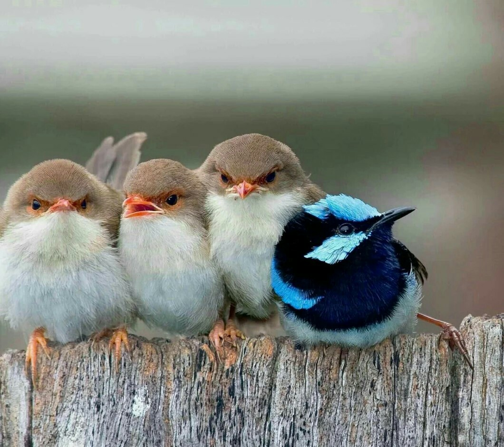

# `Birds Detection`

## `Структура проекта`

### :point_right:  [Перейти в раздел для Телеграмм-бота]

### :point_right:  [Перейти в раздел для Модели]

 ## `Описание проекта`

Проект разработан для детектирования по видео, фото изображениям птиц в интересах ученых, орнитологов, любителей птиц.

## `Описание проблемы`

Для **ученых и орнитологов** изучение перелетов птиц важно для:
- получения информации о местах расселения определенных видов птиц, их численности, выживаемости и скорости размножения
- исследования глобальных проблем, например глобального потепления
- контроля распространения инфекций, переносимых  птицами

На рынке товаров для животных широко представлены кормушки с камерой для птиц, пользующиеся спросом у **орнитологов-любителей**. Кормушки с опцией детектирования птиц будут пользоваться еще большим спросом.

## `Этапы решения`

1. Сбор исходных видео и фотографий с птицами.
2. Разметка птиц на исходных материалах.
3. Обучение нейронной сети YOLOv8 по размеченным данным.
4. Тестирование нейронной сети на неразмеченных данных.
5. Создание телеграмм-бота для детектирования птиц, использующий обученную модель.
6. Тестирование телеграмм-бота.
7. Размещение телеграмм-бота на сервере.

## `Результат`

В результате проведенных работ была обучена модель нейронной сети YOLOv8 для детектирования следующих видов птиц:

|№|Класс|Виды|
|:---:|:---:|:---:|
|1|sparrow|Воробей домовой, воробей полевой, чернобровая овсянка|
|2|pigeon|голубь, вяхирь, горлинка|
|3|tit|большая синица, лазоревка, черноголовая гаичка|
|4|thrush|Дрозд-отшельник, певчий дрозд, Свенсонов дрозд|
|5|woodpecker|Большой пестрый дятел, малый пестрый дятел, желтошапочный дятел|
|6|cardinal|Красный кардинал|

Были получены следующие метрики качества:

- Доля верно классифицированных объектов из всех классификаций (precision): 0.91
- Доля верно классифицированных объектов из всех целевых объектов (recall): 0.92
- Средняя средняя точность для обнаружения всех объектов (mAP): 0.96

Разработан и размещен на сервере телеграмм-бот, детектирующий птиц на фотографиях.
